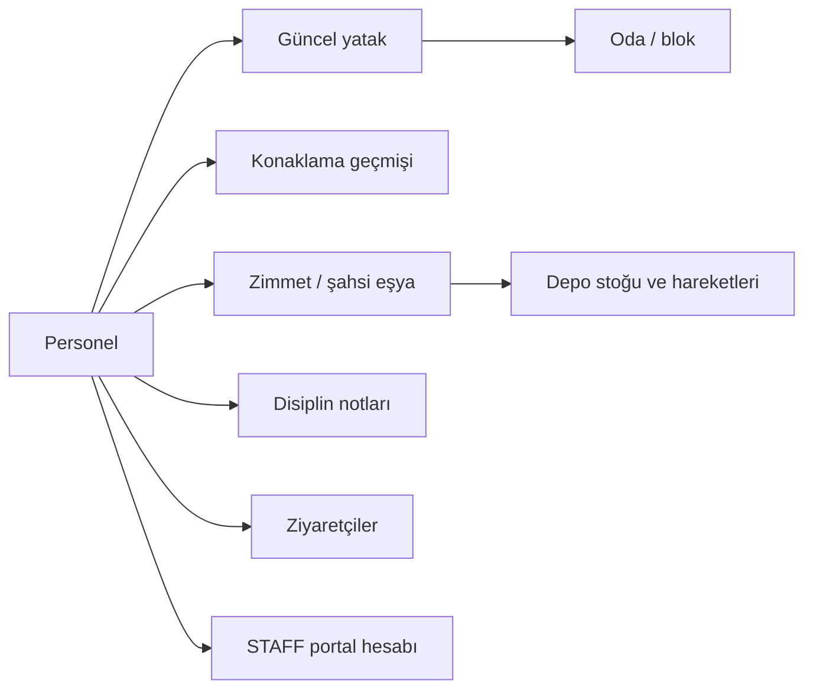

# Personel Yönetimi — Canlı İşleyiş ve Güvenlik Kuralları

## Sekmeler ve veri kaynakları

- **Genel bilgiler:** Personel profili, güncel oda/yatak, çalışma ve iletişim bilgileri.
- **Zimmet ve şahsi eşya:** `InventoryItem` kayıtları; depo zimmetleri `StockItem` ve `StockMovement` ile bağlıdır.
- **Şikâyet ve disiplin:** `DisciplinaryNote` kayıtları. Silme fiziksel silme değil, denetim için arşivlemedir.
- **Oda değişimleri:** Sahte arayüz verisi kullanılmaz; `OccupancyLog` geçmişinden üretilir.
- **Ziyaretçiler:** `Visitor.hostEmployeeId` üzerinden personelle bağlı gerçek ziyaretçi kayıtlarıdır.
- **Konaklama geçmişi:** Oda/yatak, giriş, çıkış, işlemi yapan kullanıcı ve transfer nedeni `OccupancyLog` üzerinden saklanır.

## Yetki sınırları

- Personel listesini yalnızca `EMPLOYEE_VIEW` yetkisi olan roller görür.
- TC/telefon/acil kişi, zimmet, disiplin ve konaklama geçmişi yalnızca `EMPLOYEE_SENSITIVE_VIEW` yetkisiyle döner ve gösterilir.
- Ekleme, güncelleme, oda atama, çıkış ve arşivleme için `EMPLOYEE_MANAGE` gerekir.
- Excel raporu ayrı `EMPLOYEE_EXPORT` yetkisine bağlıdır.
- Ziyaretçi sekmesi `VISITOR_VIEW`, yeni ziyaretçi işlemi `VISITOR_MANAGE` gerektirir.
- Personel portal hesabı yalnızca açık talep ve `USER_MANAGE` yetkisiyle oluşturulur; rolü zorunlu olarak `STAFF` olur.

## Canlı veri bütünlüğü kuralları

- `RESIDENT` personelin tam bir güncel yatağı ve tek açık konaklama kaydı bulunmalıdır.
- Oda çıkışı aktif depo zimmeti veya içeride ziyaretçi varken yapılamaz.
- Oda çıkışı yatağı boşaltır, açık konaklamayı kapatır ve bağlı portal hesabını pasifleştirir.
- Ayrılmış personelin yeniden yatağa atanması durumunu `RESIDENT` yapar, eski çıkış yapan kullanıcı bilgisini temizler ve portal hesabını yeniden etkinleştirir.
- Aynı seri numarası eşzamanlı olarak başka bir personel veya oda zimmetinde kullanılamaz. Kontrol, veritabanı işlemi ve ortak danışma kilidiyle yarış koşullarına karşı korunur.
- Stok zimmeti iadesi tek sefer yapılabilir; eşzamanlı ikinci istek stok sayacını değiştiremez.
- Personel ve hassas bağlı kayıtlar denetim geçmişini korumak amacıyla yumuşak silinir.
- Personel oluşturulurken açıkça portal hesabı istenmediyse kullanıcı hesabı oluşturulmaz.
- Liste ve rapor sonuçlarında üst sınır uygulanır; geniş sorgular filtre daraltma hatasıyla durdurulur.
- Excel metinleri formül enjeksiyonuna karşı güvenli hücre değerine çevrilir.

## Bağlı modüller

## Üretim doğrulaması

- Backend test paketi: 36/36 başarılı.
- Backend ve frontend üretim derlemeleri başarılı.
- Docker imajları yeniden oluşturuldu; migration `20260811190000_harden_employee_management` uygulandı.
- Geçici verilerle 18 adımlı canlı PostgreSQL senaryosu başarılı oldu ve tüm geçici kayıtlar temizlendi.
- Üretim bağımlılık taramalarında backend ve frontend için bilinen açık bulunmadı.
- Tutarlılık taramasında oda/personel durumu, açık konaklama, aktif zimmet, ziyaretçi, seri numarası ve arşiv tutarsızlığı bulunmadı.

## Operasyon notu

Veritabanında aktif bir `STAFF` hesabı herhangi bir aktif personel kaydına bağlı değildir. Eski/özel amaçlı hesap olabileceği için otomatik silinmemiştir. Canlı açılış öncesinde hesap sahibi doğrulanmalı; gereksizse kullanıcı yönetiminden pasifleştirilmelidir.
